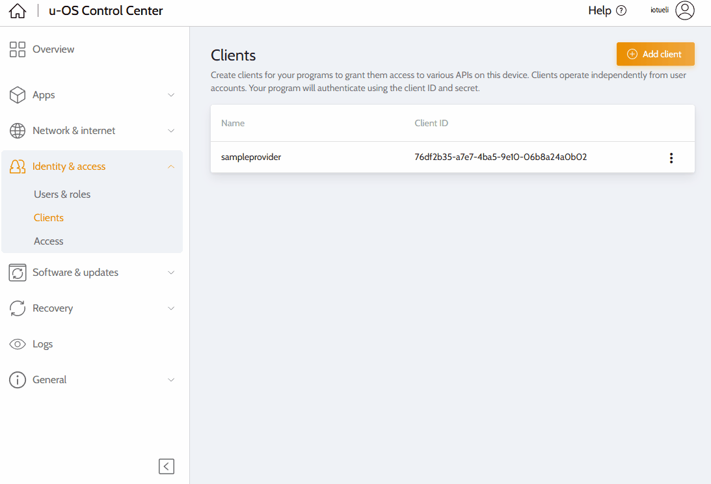
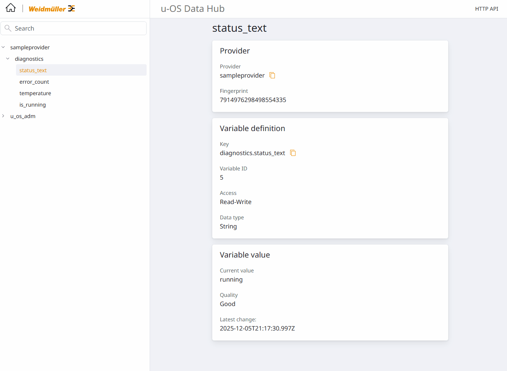

# Node.js NATS Sample

Dieses Sample zeigt, wie du aus Node.js heraus einen simplen Provider und Consumer für den u-OS Data Hub aufsetzt. Die Messages sind JSON-basiert und dienen als leichtgewichtige Alternative zu den umfangreichen FlatBuffer-Beispielen aus dem Python-Sample.

## Voraussetzungen

1. **OAuth-Clients anlegen**: Im u-OS Control Center (Screenshot siehe `docs/control-center-clients.png`) zu *Identity & access → Clients → Add client* wechseln und oben rechts auf **Add client** drücken.
   - **Provider** `sampleprovider`: Access `hub.variables` → Rolle **Provide**
   - **Consumer** `sampleconsumer`: Access `hub.variables` → Rolle **ReadWrite** (oder Read)
   - Die zugehörigen Client ID & Secrets notieren.



## Setup

```bash
cd nats-node-sample
cp .env.example .env
npm install
```

`npm install` generiert `node_modules/` und kompiliert den FlatBuffer-Code in `src/fbs`. Trage anschließend in `.env` Host/IP, Port und OAuth-Credentials ein. Die Werte findest du im u-OS Control Center unter **Identity & access → Clients → Add client** (siehe Screenshot im Python-README). Gib dem Client sowohl **Provide** als auch **Read & write** Rechte, damit er die offiziellen Subjects verwenden darf.

> Wie im Python-Projekt deaktiviert `auth.ts` standardmäßig die TLS-Zertifikatsprüfung (self-signed). Für produktive Umgebungen solltest du das echte Zertifikat installieren und `NODE_TLS_REJECT_UNAUTHORIZED` wieder aktivieren.

## Provider starten

```bash
npm run provider
```

- Holt automatisch ein OAuth-Token (Scope `hub.variables.provide hub.variables.readwrite`)
- Stellt eine NATS-Verbindung (`token`-Auth, Inbox `_INBOX.<Client>`) her
- Publiziert Providerdefinition + Variablenänderungen auf den offiziellen u-OS Subjects (`v1.loc.<provider>.def/vars.…`)



## Consumer starten

```bash
npm run consumer
```

- Holt ebenfalls ein OAuth-Token
- Fragt über `v1.loc.<provider>.vars.qry.read` einen Snapshot ab und lauscht danach auf `…vars.evt.changed`

## Tipps

- Für mehrere Provider kannst du mehrere `.env`-Dateien mit unterschiedlichen `PROVIDER_ID`/`CLIENT_*`-Werten anlegen.
- Wenn du anstelle von OAuth ein festes Token verwenden willst, kannst du `NATS_TOKEN=<token>` ergänzen und den Request in `auth.ts` entsprechend anpassen.
- Die komplette Provider-/Consumer-Logik ist in TypeScript umgesetzt und orientiert sich am Python-Sample – Feel free to reuse die Module (`payloads.ts`, `simulation.ts`, …) in deinem eigenen Projekt.
